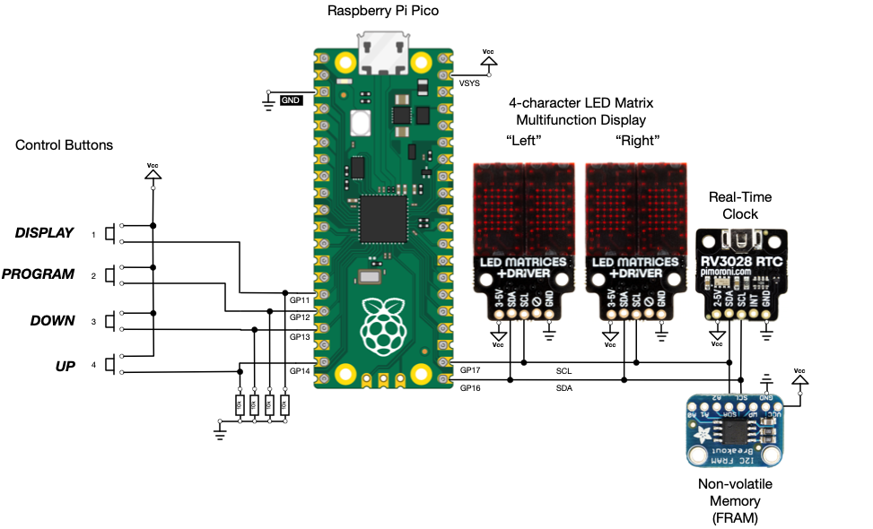

# mp-pico-ra-calculator

A real-time Right Ascension (RA) compensation calculator.

Given a target RA and calibration date this code displays the compensated
RA value for a telescope with a fixed RA-aligned axis.

It is designed to run on a Raspberry Pi [Pico] with the assistance of I2C-based
devices that consist of a pair of [dot-matrix] displays, non-volatile memory
in the form of a [FRAM], and a [Real-Time Clock] module.

It's essentially a handy, portable, real-time implementation of the
'trick' described in my related repository: -

- https://github.com/alanbchristie/ra-converter

---

[dot-matrix]: https://shop.pimoroni.com/products/led-dot-matrix-breakout?variant=32274405621843
[fram]: https://shop.pimoroni.com/products/adafruit-i2c-non-volatile-fram-breakout-256kbit-32kbyte
[pico]: https://shop.pimoroni.com/products/raspberry-pi-pico?variant=32402092294227
[real-time clock]: https://shop.pimoroni.com/products/rv3028-real-time-clock-rtc-breakout
